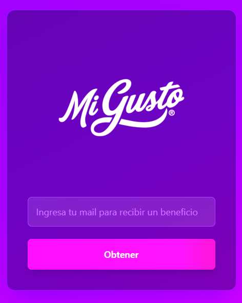
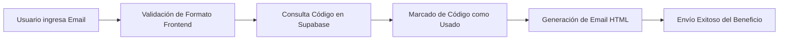

  

  # IAE x Mi Gusto

  **Plataforma web de automatización y entrega de beneficios exclusivos para la campaña IAE.**

  
  
  
  
  

   

  

---

## 📌 Descripción

Aplicación web desarrollada con **Vite**, **React** y **TypeScript** orientada a automatizar la entrega de beneficios personalizados durante la campaña exclusiva para la **IAE**. La solución garantiza una experiencia fluida, rápida y segura, integrando validaciones de email en tiempo real y asignación única de códigos promocionales respaldados por **Supabase**.

---

## 🚀 Características Principales

- 🎨 **Interfaz de Alto Impacto Visual**: Formulario simple, elegante y 100% responsivo con retroalimentación inmediata diseñado en Tailwind CSS.
- ✉️ **Validación Avanzada de Correos**: Verificación rigurosa de formato e integridad antes de procesar cualquier solicitud.
- 🔑 **Asignación Única y Segura de Códigos**: Consulta atómica a la tabla `email_codes` en Supabase, registrando el timestamp y previniendo la duplicidad de uso.
- 📧 **Plantillas HTML Dinámicas**: Generación y despacho automático de correos electrónicos adaptativos (HTML + Texto Plano).

---

## 🔄 Flujo Funcional

1. **Ingreso de datos**: El usuario completa su dirección de correo en la plataforma.
2. **Validación inicial**: Frontend verifica la sintaxis del email y el estado del servicio.
3. **Reserva en base de datos**: Supabase asigna el primer código disponible en `email_codes` y registra el consumo.
4. **Construcción del mensaje**: Se ensambla la plantilla HTML dinámica personalizada.
5. **Notificación**: Se despacha el beneficio directamente a la bandeja del usuario.

---

## 👥 Créditos y Desarrollo

| Desarrollador | Enlaces |
| :--- | :--- |
| **Facundo Carrizo** |   |
| **Ramiro Lacci** |   |

---

## ⚖️ Licencia

© 2025 **Mi Gusto**. Todos los derechos reservados. Proyecto privado para uso comercial exclusivo de la marca.

> Mi Gusto ® es una marca registrada de **La Honoria Alimentos S.A.** — Argentina — CUIT: 30-71558654-8

